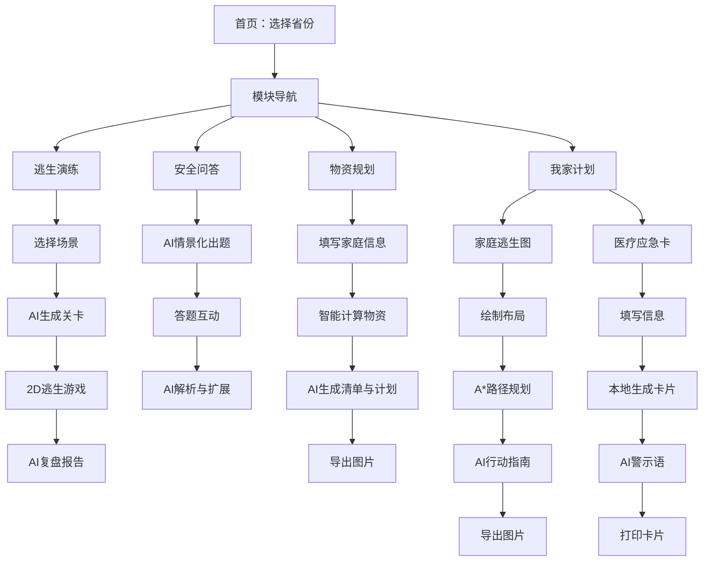

## 1. 产品概述

"安全小象"是一款面向中小学生及家庭的安全教育互动平台，以IP角色"安全小象"贯穿全流程，整合逃生演练、安全问答、物资规划、家庭计划四大模块，通过生成式AI动态生成个性化内容，让安全教育从"被动接受"变为"主动参与"。

- 目标用户：中小学生（6-15岁）及其家庭，校园/社区安全教育场景
- 核心价值：基于用户省份和灾害风险生成个性化安全训练内容，AI驱动动态关卡与复盘，实现"千人千面"的安全教育体验

## 2. 核心功能

### 2.1 用户角色

| 角色 | 注册方式 | 核心权限 |
|------|----------|----------|
| 学生/家庭用户 | 无需注册，直接使用 | 选择省份、使用全部四大模块功能 |
| 访客 | 无需注册 | 浏览基础内容 |

### 2.2 功能模块

1. **首页/省份选择页**：IP形象展示、省份选择、四大模块入口导航
2. **模块一：逃生演练**：场景选择 → AI生成关卡 → 2D俯视逃生游戏 → AI复盘报告
3. **模块二：安全问答**：AI情景化出题 → 答题互动 → AI生成解析与扩展
4. **模块三：物资规划**：家庭信息表单 → 智能计算 → AI生成清单与周计划 → 导出图片
5. **模块四：我家计划**：家庭逃生图绘制（A*路径规划）+ 个人医疗应急卡（本地隐私处理）

### 2.3 页面详情

| 页面名称 | 模块名称 | 功能描述 |
|----------|----------|----------|
| 首页 | 省份选择 | 选择所在省份，用于后续AI个性化内容生成；展示安全小象IP形象和四大模块入口卡片 |
| 首页 | 模块导航 | 四大模块以卡片形式展示，点击进入对应模块 |
| 逃生演练-场景选择 | 场景卡片 | 并列展示"学校教室""医院""电影院"三个场景卡片，安全小象旁白引导 |
| 逃生演练-游戏主界面 | 2D逃生游戏 | 穿安全服小象角色，四方向行走精灵动画；2D俯视网格地图；生命值/倒计时HUD；灾害特效（地震晃动/火灾蔓延）；道具拾取；终点判定 |
| 逃生演练-AI关卡生成 | AI动态关卡 | 根据省份+场景+灾害类型调用AI生成JSON关卡数据，动态修改地图 |
| 逃生演练-复盘报告 | AI复盘 | 展示AI生成的复盘报告，包含用时、路径分析、错误提示、AI内容合理性批判提示 |
| 安全问答-主界面 | 答题互动 | 中央题目显示，下方选项按钮；安全小象表情变化（对/错动画）；答题后气泡反馈 |
| 安全问答-AI出题 | AI情景化出题 | 从知识库抽取知识点，AI生成情景化题目 |
| 安全问答-AI解析 | AI解析扩展 | AI生成亲切口吻的解析，包含跨学科知识扩展 |
| 物资规划-表单页 | 家庭信息收集 | 家庭人数、老人/儿童/婴儿数、慢性病、住宅类型、防范灾害多选 |
| 物资规划-结果页 | 物资清单展示 | 卡片式物资清单展示，AI生成温馨分类文本和四周准备计划 |
| 物资规划-导出 | 图片导出 | 将清单和计划渲染为图片并下载 |
| 我家计划-逃生图 | 交互式绘图 | Canvas绘图工具栏（墙/门/窗/家具/灭火器等）；拖拽/缩放/旋转；门/窗标记为逃生出口；A*路径规划算法；AI生成行动指南 |
| 我家计划-逃生图导出 | 合并导出 | 画布内容+文字指南合并生成图片 |
| 我家计划-医疗卡表单 | 信息收集 | 姓名、出生日期、紧急联系人、血型、过敏史、疾病史、用药、手术史 |
| 我家计划-医疗卡生成 | 卡片生成与打印 | 本地生成医疗应急卡；AI生成核心警示语和给救援者的话；打印按钮（A4纸+过塑提示） |

## 3. 核心流程

### 3.1 主流程

用户进入首页 → 选择省份 → 进入任一模块 → 完成模块任务 → 查看AI生成结果 → 导出/分享

### 3.2 逃生演练流程

选择场景 → AI根据省份+场景生成关卡JSON → 解析JSON加载地图 → 玩家操控小象逃生 → 灾害事件触发 → 到达终点/时间耗尽 → AI生成复盘报告 → 展示报告（含批判性思维提示）

### 3.3 安全问答流程

从知识库筛选省份关联题目 → AI基于知识点生成情景化题目 → 用户答题 → 小象表情反馈 → AI生成解析与跨学科扩展 → 下一题

### 3.4 物资规划流程

填写家庭信息表单 → 计算引擎遍历物资库 → AI生成个性化分类清单 → AI生成四周准备计划 → 展示结果 → 导出图片

### 3.5 我家计划流程

**逃生图**：打开绘图工具 → 绘制家居布局 → 标记逃生出口 → A*算法计算路径 → AI生成行动指南 → 合并导出图片

**医疗卡**：填写个人信息 → 本地处理数据 → AI生成核心警示语 → AI生成给救援者的话 → 生成卡片 → 打印

### 3.6 流程图

## 4. 用户界面设计

### 4.1 设计风格

- **主色调**：温暖橙色（#FF6B35）作为品牌色，搭配安全绿（#2ECC71）和警示红（#E74C3C）
- **辅助色**：柔和米白（#FFF8F0）背景、深灰（#2C3E50）文字
- **按钮风格**：圆角大按钮，3D立体感，悬停有弹跳微动画
- **字体**：标题使用"ZCOOL KuaiLe"（站酷快乐体）体现童趣，正文使用"Noto Sans SC"保证可读性
- **布局风格**：卡片式布局，圆角卡片带柔和阴影；顶部导航栏
- **图标/表情风格**：圆润可爱的扁平化图标，安全小象IP贯穿全站
- **整体风格**：Playful/Toy-like + 温馨友好，面向儿童但不幼稚

### 4.2 页面设计概览

| 页面名称 | 模块名称 | UI元素 |
|----------|----------|--------|
| 首页 | Hero区域 | 安全小象大形象居中，省份下拉选择器，四大模块入口卡片（带图标和渐变色），背景使用柔和渐变+装饰性云朵/星星元素 |
| 逃生演练-场景选择 | 场景卡片 | 三列卡片布局，每张卡片含场景插图和名称，悬停放大效果，小象旁白气泡 |
| 逃生演练-游戏界面 | 游戏区域 | 中央2D俯视地图Canvas，左上角小象头像+生命值条+倒计时，底部虚拟方向键（移动端），灾害特效覆盖层 |
| 逃生演练-复盘 | 报告展示 | 卡片式报告布局，小象表情+评语，路径回放缩略图，批判性思维提示高亮框 |
| 安全问答-主界面 | 答题区域 | 中央题目卡片，四个选项按钮（A/B/C/D），右侧小象形象区域（表情动画），底部进度条 |
| 物资规划-表单 | 表单区域 | 顶部小象形象+旁白，分段式表单（基本信息/家庭成员/灾害选择），进度指示器 |
| 物资规划-结果 | 清单展示 | 分类卡片（食品/饮水/医疗/工具/文档），每项含图标+名称+数量，底部周计划时间线，导出按钮 |
| 我家计划-逃生图 | 绘图工具 | 左侧工具栏（图标按钮），中央Canvas画布，右侧属性面板，底部"计算路径"和"生成指南"按钮 |
| 我家计划-医疗卡 | 卡片生成 | 左侧表单，右侧实时预览卡片，隐私提示横幅，底部"生成卡片"和"打印"按钮 |

### 4.3 响应式设计

- 桌面优先设计（1920×1080基准）
- 平板适配（768px-1024px）：游戏界面缩放，表单单列布局
- 移动端适配（<768px）：虚拟方向键操控，卡片堆叠，底部导航

### 4.4 动画与交互

- 页面切换：淡入淡出 + 轻微上滑
- 卡片悬停：scale(1.05) + 阴影加深
- 小象表情：CSS sprite动画切换
- 游戏角色：四方向8帧精灵动画
- 灾害特效：地震用CSS shake动画，火灾用Canvas粒子效果
- 答题反馈：正确绿色脉冲，错误红色抖动
- AI生成中：小象"思考"动画 + 加载进度条
