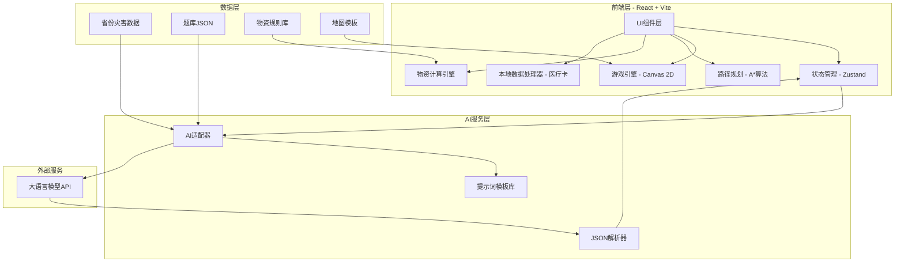

## 1. 架构设计



## 2. 技术说明

- **前端框架**：React 18 + TypeScript + Vite
- **样式方案**：TailwindCSS 3 + CSS Modules（游戏特效）
- **状态管理**：Zustand（轻量级，适合中等复杂度应用）
- **游戏引擎**：原生Canvas 2D API（逃生演练模块）
- **路径规划**：自实现A*算法（我家计划模块）
- **图片导出**：html2canvas（物资清单/逃生图/医疗卡导出）
- **AI调用**：通过前端直接调用大语言模型API（用户自行配置API Key）
- **数据存储**：所有数据本地存储（localStorage），医疗卡数据纯前端处理不上传
- **字体**：Google Fonts - ZCOOL KuaiLe + Noto Sans SC
- **图标**：Lucide React
- **动画**：Framer Motion

## 3. 路由定义

| 路由 | 用途 |
|------|------|
| / | 首页：省份选择 + 模块导航 |
| /escape | 逃生演练：场景选择 |
| /escape/game | 逃生演练：游戏主界面 |
| /escape/report | 逃生演练：复盘报告 |
| /quiz | 安全问答：答题主界面 |
| /supplies | 物资规划：表单页 |
| /supplies/result | 物资规划：结果页 |
| /home-plan | 我家计划：模块入口 |
| /home-plan/escape-map | 我家计划：家庭逃生图 |
| /home-plan/medical-card | 我家计划：医疗应急卡 |

## 4. AI调用设计

### 4.1 AI适配器架构

```typescript
interface AICallConfig {
  prompt: string;
  expectJSON?: boolean;
  temperature?: number;
}

interface AIResponse {
  content: string;
  parsedJSON?: any;
}
```

### 4.2 AI调用点汇总

| 模块 | 调用场景 | 输入 | 期望输出 | 提示词模板 |
|------|----------|------|----------|------------|
| 逃生演练 | 生成关卡 | 省份+场景+灾害 | JSON（地图配置） | escape-level-generation |
| 逃生演练 | 生成复盘 | 用时+路径+错误 | 文本（复盘报告） | escape-review-generation |
| 安全问答 | 情景化出题 | 知识点+省份 | JSON（题目） | quiz-scenario-generation |
| 安全问答 | 生成解析 | 用户答案+正确答案+题目 | 文本（解析） | quiz-explanation-generation |
| 物资规划 | 生成清单文本 | 物资数据 | 文本（分类清单） | supplies-list-generation |
| 物资规划 | 生成周计划 | 家庭描述+物资 | 文本（周计划） | supplies-plan-generation |
| 我家计划 | 生成行动指南 | 路径描述+家居特点 | 文本（行动指南） | escape-guide-generation |
| 我家计划 | 生成核心警示 | 医疗关键词 | 文本（警示语） | medical-alert-generation |
| 我家计划 | 生成救援者话 | 口语化病史 | 文本（专业表述） | medical-rescue-generation |

### 4.3 API Key管理

- 用户首次使用时在设置页面输入自己的API Key
- API Key存储在localStorage，仅本地使用
- 每次AI调用前检查Key是否存在，不存在则提示用户配置
- 支持OpenAI兼容API格式（可配置baseURL）

## 5. 数据模型

### 5.1 省份灾害数据

```typescript
interface ProvinceData {
  name: string;
  commonDisasters: string[];
  riskLevel: Record<string, 'high' | 'medium' | 'low'>;
}
```

### 5.2 题库数据

```typescript
interface Question {
  id: string;
  question: string;
  options: Record<string, string>;
  answer: string;
  explanation: string;
  tags: {
    provinces: string[];
    disasterTypes: string[];
    knowledgePoints: string[];
  };
  difficulty: 1 | 2 | 3;
}
```

### 5.3 物资规则库

```typescript
interface SupplyItem {
  name: string;
  category: 'food' | 'water' | 'medical' | 'tool' | 'document' | 'clothing' | 'hygiene';
  basePerPersonPerDay?: number;
  unit: string;
  forDisasters: string[];
  forGroups?: {
    infant?: { note: string; extraAmount?: number };
    elderly?: { note: string; extraAmount?: number };
    chronic?: { note: string; extraAmount?: number };
  };
  minDays: number;
}
```

### 5.4 地图模板

```typescript
interface MapTemplate {
  id: string;
  name: string;
  gridSize: { cols: number; rows: number };
  cellSize: number;
  startPoint: { x: number; y: number };
  endPoint: { x: number; y: number };
  obstacles: { x: number; y: number; type: string }[];
  items: { x: number; y: number; type: string }[];
  disasterType: 'earthquake' | 'fire';
}
```

### 5.5 游戏状态

```typescript
interface GameState {
  playerPosition: { x: number; y: number };
  playerDirection: 'up' | 'down' | 'left' | 'right';
  health: number;
  timeRemaining: number;
  collectedItems: string[];
  path: { x: number; y: number }[];
  errors: string[];
  isComplete: boolean;
}
```

### 5.6 医疗卡数据

```typescript
interface MedicalCardData {
  name: string;
  birthDate: string;
  emergencyContacts: { name: string; phone: string; relation: string }[];
  bloodType: string;
  severeAllergies: string;
  majorDiseases: string;
  dailyMedications: string;
  surgeryHistory: string;
  aiAlertText: string;
  aiRescueText: string;
}
```

## 6. 项目目录结构

```
src/
├── components/          # 通用组件
│   ├── Layout/          # 布局组件
│   ├── ElephantMascot/  # 安全小象IP组件
│   ├── AILoading/       # AI生成加载动画
│   └── ExportButton/    # 导出按钮组件
├── pages/               # 页面组件
│   ├── Home/            # 首页
│   ├── Escape/          # 逃生演练
│   ├── Quiz/            # 安全问答
│   ├── Supplies/        # 物资规划
│   └── HomePlan/        # 我家计划
├── engines/             # 核心引擎
│   ├── gameEngine/      # 游戏引擎（Canvas 2D）
│   ├── pathFinder/      # A*路径规划
│   └── supplyCalc/      # 物资计算引擎
├── services/            # 服务层
│   ├── aiService/       # AI调用服务
│   └── storageService/  # 本地存储服务
├── data/                # 静态数据
│   ├── provinces.ts     # 省份灾害数据
│   ├── questionBank.ts  # 题库
│   ├── supplyDB.ts      # 物资规则库
│   └── mapTemplates.ts  # 地图模板
├── stores/              # Zustand状态
│   ├── appStore.ts      # 全局状态
│   ├── gameStore.ts     # 游戏状态
│   └── quizStore.ts     # 问答状态
├── types/               # TypeScript类型
├── utils/               # 工具函数
├── styles/              # 全局样式
└── App.tsx              # 应用入口
```

## 7. 关键技术实现要点

### 7.1 游戏引擎

- 使用requestAnimationFrame驱动游戏循环
- 精灵动画：通过CSS sprite sheet或Canvas drawImage实现四方向8帧动画
- 碰撞检测：基于网格的AABB碰撞检测
- 灾害特效：地震用CSS transform shake动画叠加，火灾用Canvas粒子系统

### 7.2 A*路径规划

- 将Canvas画布网格化（每格20px）
- 墙壁和大型家具标记为不可通行
- 门和窗标记为逃生出口
- 使用曼哈顿距离作为启发函数
- 路径用彩色箭头线绘制在Canvas上

### 7.3 AI调用安全

- 所有AI调用通过统一的aiService封装
- 提示词模板化，避免注入攻击
- JSON解析使用try-catch + schema验证
- 医疗卡数据绝不发送到AI服务（仅发送关键词生成警示语）

### 7.4 隐私保护

- 医疗卡所有数据处理在浏览器前端完成
- 页面醒目提示"您的信息仅用于本地生成卡片，不会被保存或上传"
- API Key仅存储在localStorage，不经过任何中间服务器
- 提供清除所有本地数据的选项

### 7.5 导出功能

- 使用html2canvas将DOM渲染为Canvas
- 转换为PNG图片下载
- 医疗卡支持window.print()打印功能
- 打印提示"选择A4纸打印，裁剪后过塑保存"
